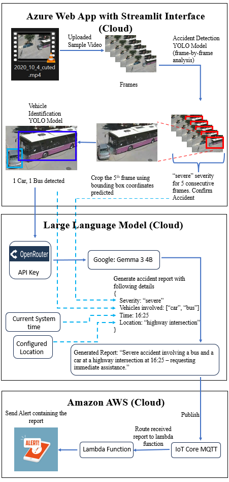
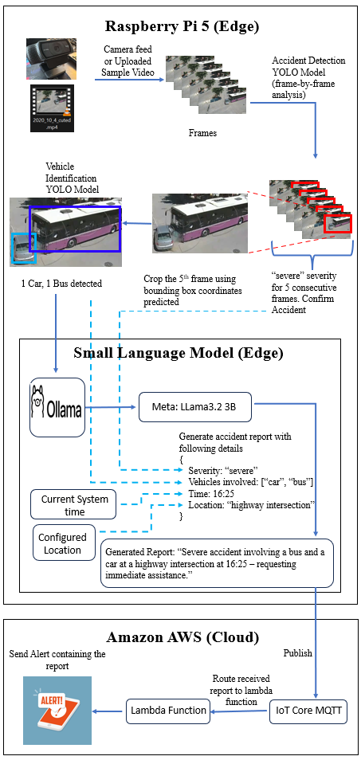
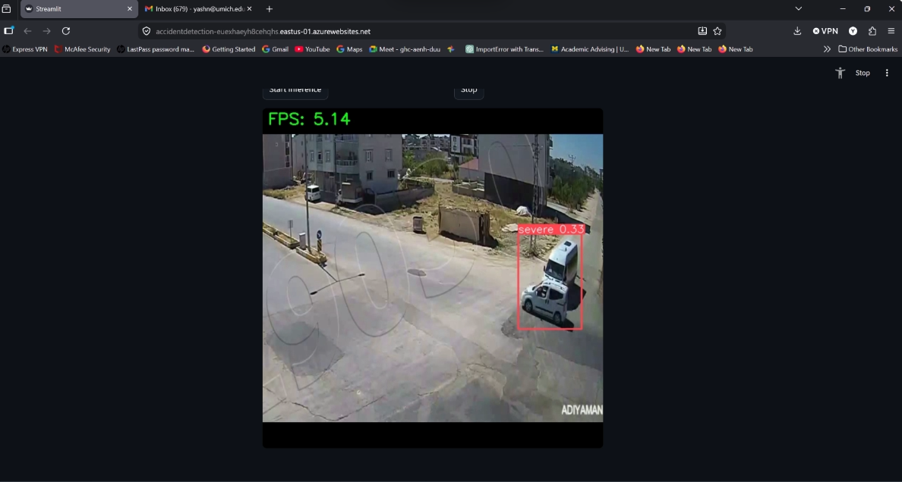
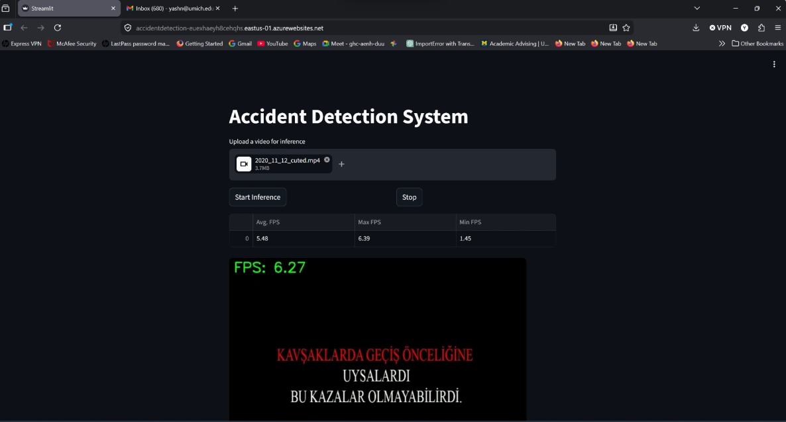
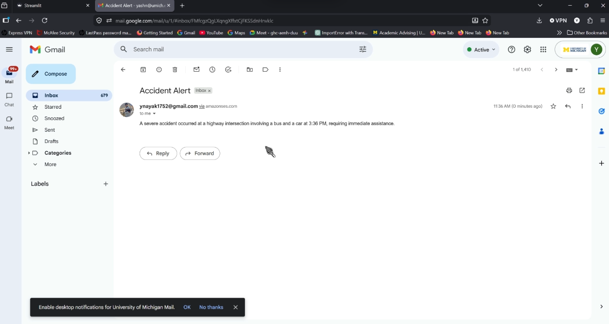
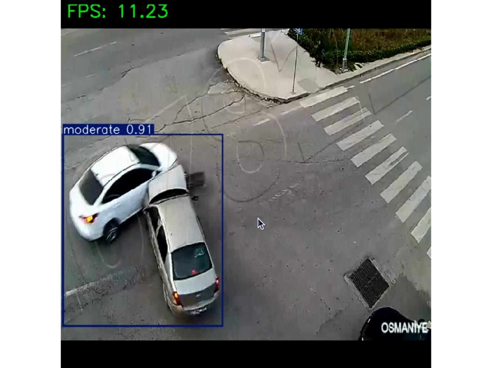
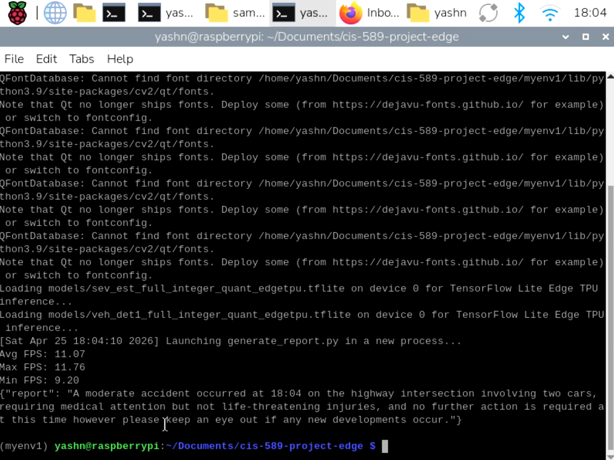
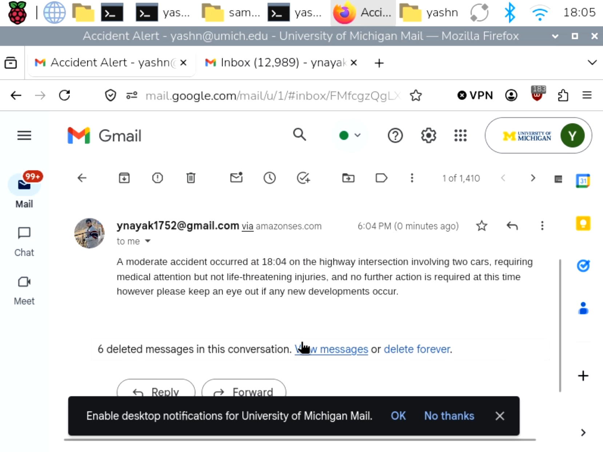
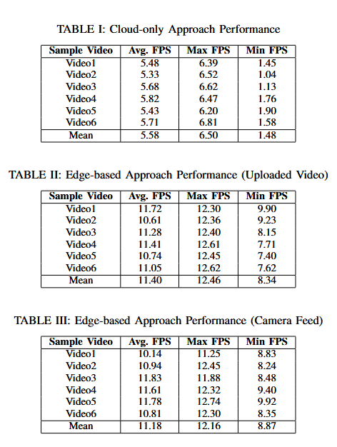

# Edge-Based Accident Detection and Severity Assessment with Automated Emergency Notification
Road accidents are often reported late due to technical errors that can delay the emergency response and can be fatal to victims. In this paper, I introduce an accident detection and severity assessment prototype using two YOLO models, that perform frame-by-frame analysis on camera footage and detect the type of vehicles involved in accident, with automated accident report generation and emergency notification, using language models and AWS services. Two prototypes were developed: one with cloud-only approach web app with Streamlit interface, deployed using Azure, that performs YOLO inference in cloud and accesses free LLM using OpenRouter API, and another with edge-based approach on Raspberry Pi 5, where YOLO inference and report generation using SLM and Ollama are performed on local hardware. 

## System Design (Cloud)

First, the system will first try to detect the car accident. The YOLO model will try to detect if a “severe”, “moderate”, “mild” accident has occurred, by analysing each and every frame from the accident video. If same severity is observed for 5 consecutive frames, then accident has taken place. This enables system to tackle false positives.

Second, using the bounding boxes coordinates predicted in the 5th frame using the first YOLO model, I am going to crop the image and send it to another YOLO model for detecting type of vehicle involved (car, truck, motorbike, bus).

Third, access an LLM using OpenRouter API to generate a short report using the output from YOLO models (severity, vehicles involved) and some additional data (current time, location).

Finally, the system will send an email alert that contains the generated report, using the AWS services.

This system was demonstrated using Streamlit interface, and was deployed in cloud by containerizing it and creating a web app for it using Dockers and Azure.

The YOLO model predictions is running in the cloud web app, LLM is accessed using API key, Notification System utilizes AWS services. So, all the components in the system are running in the cloud.

## System Design (Edge)

First, the system will first try to detect the car accident. The YOLO model will try to detect if a “severe”, “moderate”, “mild” accident has occurred, by analysing each and every frame from the accident video or camera feed. If same severity is observed for 5 consecutive frames, then accident has taken place. This enables system to tackle false positives.

Second, using the bounding boxes coordinates predicted in the 5th frame using the first YOLO model, I am going to crop the image and send it to another YOLO model for detecting type of vehicle involved (car, truck, motorbike, bus).

Third, access an SLM using Ollama that runs locally to generate a short report using the outputs from YOLO models (severity, vehicles involved) and some additional data (current time, location).

Finally, the system will send a notification alert that contains the generated report, using the AWS services.

The YOLO model predictions is running in Raspberry Pi 5 hardware locally, SLM runs locally to generate report. Notification system utilizes AWS services. So, YOLO models inference and report generation runs on the edge, while the notification system runs in the cloud.

## Results
Experimental results demonstrated that the edge-based approach significantly outperforms the cloud-only setup in speed. Mean FPS increases from 5.58 FPS (cloud) to 11.40 FPS for uploaded video and 11.18 FPS for live camera feed - about 2× faster overall. It is also much more stable, with minimum FPS improving from just 1.48 FPS in the cloud setup to 8.34 FPS (uploaded video) and 8.87 FPS (camera feed), indicating lower latency fluctuations and smoother real-time performance.

Cloud-only System Link: http://accidentdetection-euexhaeyh8cehqhs.eastus-01.azurewebsites.net

